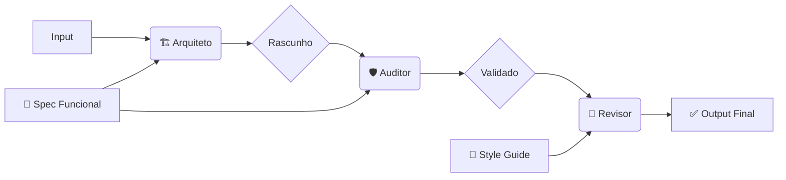

Aqui está o `README.md` ajustado para o nome **xpec-gen**, focado em ser direto e técnico.

# xpec-gen

[](https://jsr.io/@aldeia-viva/xpec-gen)
[](https://opensource.org/licenses/MIT)

> **Spec-Driven Development Engine.**
> Gere código auditado por IA através de fluxos adversários e injeção de contexto.

O **xpec-gen** é uma CLI que orquestra múltiplos agentes de IA para garantir que o código gerado siga estritamente suas especificações técnicas e regras de estilo, eliminando alucinações de arquitetura.

---

## 📦 Instalação

### Global (Recomendado)
```bash
deno install --global -A -n xpec-gen jsr:@aldeia-viva/xpec-gen
````

### Execução Única (DLX)

```bash
deno run -A jsr:@aldeia-viva/xpec-gen --help
```

-----

## ⚙️ Arquitetura

O `xpec-gen` utiliza um pipeline de 3 estágios para garantir qualidade:



1.  **Arquiteto:** Gera a solução baseada na Spec.
2.  **Auditor (Adversário):** Valida o código contra a Spec. Corrige violações de segurança e lógica.
3.  **Revisor:** Aplica regras de linter, documentação e padronização.

-----

## 🚀 Uso

### 1\. Geração Rápida

Gera código sem contexto externo.

```bash
xpec-gen "Função em TypeScript para validar CNPJ"
```

### 2\. Geração Guiada por Spec (Core)

Obriga a IA a seguir sua arquitetura (ex: Hono, Zod, Deno KV).

```bash
xpec-gen --spec tech-stack.md "Endpoint de Login"
```

### 3\. Pipeline Completo (Com Code Review)

Gera, audita e aplica guia de estilo.

```bash
xpec-gen \
  --spec tech-stack.md \
  --review style-guide.md \
  --out auth.ts \
  "Endpoint de Login"
```

-----

## 🔧 Configuração

Defina sua chave da OpenRouter via variável de ambiente ou arquivo `.env`:

```bash
export OPENROUTER_API_KEY="sk-or-v1-..."

# Opcional (Default: google/gemini-2.0-flash-exp:free)
export OPENROUTER_MODEL="anthropic/claude-3-5-sonnet"
```

-----

## 📄 Exemplos de Specs

**`tech-stack.md` (Exemplo):**

```markdown
# REGRAS TÉCNICAS
- Runtime: Deno
- Web Framework: Hono
- Validation: Zod
- Database: Supabase JS
- Forbidden: Do not use 'any', use 'unknown'.
```

**`style-guide.md` (Exemplo):**

```markdown
# ESTILO
- Use JSDoc em todas as funções exportadas.
- Variáveis em snake_case.
- Adicione comentário: // Generated by xpec-gen
```

-----

## Licença

MIT

```
```
